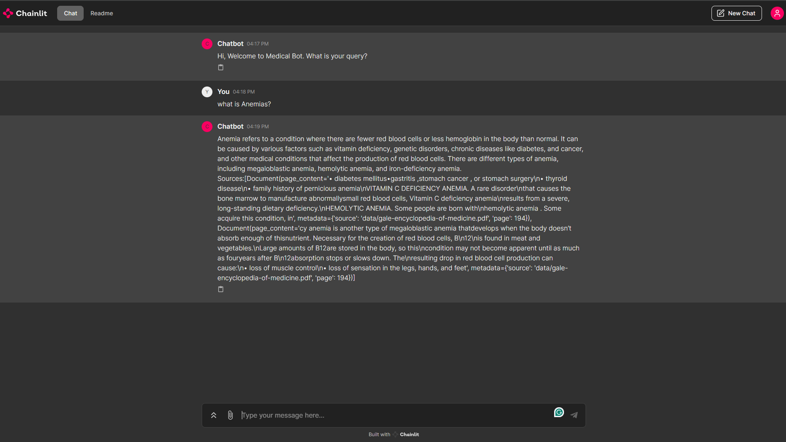

# Medical Question Answering Bot using Llama2

The Llama2 Medical Bot is a powerful tool designed to provide medical information by answering user queries using state-of-the-art language models and vector stores. This README will guide you through the setup and usage of the Llama2 Medical Bot.

## Table of Contents

- [Introduction](#langchain-medical-bot)
- [Table of Contents](#table-of-contents)
- [Prerequisites](#prerequisites)
- [Installation](#installation)
- [Getting Started](#getting-started)
- [Usage](#usage)
- [Contributing](#contributing)

# UI



## Prerequisites

Before you can start using the Llama2 Medical Bot, make sure you have the following prerequisites installed on your system:

- Python 3.6 or higher
- Required Python packages (you can install them using pip):
    - langchain
    - chainlit
    - sentence-transformers
    - faiss
    - PyPDF2 (for PDF document loading)

## Installation

1. Clone this repository to your local machine.

    ```bash
    git clone https://github.com/AquibPy/LLAMA-2-Medical-Bot.git
    cd LLAMA-2-Medical-Bot
    ```

2. Create a Python virtual environment (optional but recommended):

    ```bash
    python -m venv venv
    source venv/bin/activate  # On Windows, use: venv\Scripts\activate
    ```

3. Install the required Python packages:

    ```bash
    pip install -r requirements.txt
    ```

4. Download LLAMA 2 using [this link](https://huggingface.co/TheBloke/Llama-2-7B-Chat-GGML/resolve/main/llama-2-7b-chat.ggmlv3.q8_0.bin?download=true) and place the model file in the main working directory of the project.


5. Set up the necessary paths and configurations in your project, including the `DB_FAISS_PATH` variable and other configurations as per your needs.

6. Run the ChatBot:
    ```bash
    chainlit run main.py -w
    ```


## Getting Started

To get started with the Llama2 Medical Bot, you need to:

1. Set up your environment and install the required packages as described in the Installation section.

2. Configure your project by updating the `DB_FAISS_PATH` variable and any other custom configurations in the code.

3. Prepare the language model and data as per the Langchain documentation.

4. Start the bot by running the provided Python script or integrating it into your application.

## Usage

The Llama2 Medical Bot can be used for answering medical-related queries. To use the bot, you can follow these steps:

1. Start the bot by running your application or using the provided Python script.

2. Send a medical-related query to the bot.

3. The bot will provide a response based on the information available in its database.

4. If sources are found, they will be provided alongside the answer.

5. The bot can be customized to return specific information based on the query and context provided.

## Contributing

Contributions to the Llama2 Medical Bot are welcome! If you'd like to contribute to the project, please follow these steps:

1. Fork the repository to your own GitHub account.

2. Create a new branch for your feature or bug fix.

3. Make your changes and ensure that the code passes all tests.

4. Create a pull request to the main repository, explaining your changes and improvements.

5. Your pull request will be reviewed, and if approved, it will be merged into the main codebase.


For more information on how to use, configure, and extend the Llama2 Medical Bot, please refer to the Langchain documentation or contact the project maintainers.

Happy coding with Llama2 Medical Bot! 🚀